# 01 — Bản đồ điều hướng (AS-IS)

## 1. Khởi động & guard

```
main()  ─ LiquidGlassWidgets.wrap ─ ProviderScope ─ MaterialApp#1 (main.dart:66)
   home: SplashScreen(onInit: _initServices, nextScreen: StartupGate)   main.dart:69-72
        │  entry anim 1100ms → init services → delay 500ms → exit fade 450ms
        │  Navigator.pushReplacement(PageRouteBuilder fade 350ms)        splash_screen.dart:209-216
        ▼
   StartupGate (FutureBuilder đọc SharedPreferences 'onboarding_completed_v1')  startup_gate.dart:7,19-22
        ├─ chưa có → WelcomeScreen  (3 trang PageView, NeverScrollable)         startup_gate.dart:35
        │       └─ "Tiếp theo"×3 hoặc "Bỏ qua" → setBool(true) → pushReplacement(MaterialPageRoute → SpendoApp)  welcome_screen.dart:59-66
        └─ đã có  → SpendoApp = MaterialApp.router(routerConfig: appRouter)     app.dart:33-39
                        initialLocation: '/'                                  app_router.dart:19
```

- **Guard duy nhất**: cờ onboarding. **Không có** auth guard, **không có** `redirect` trong GoRouter (`app_router.dart:17-59` không khai báo `redirect`).
- Splash có state lỗi: nếu `_initServices` throw → hiện "Không thể khởi động ứng dụng." + nút "Thử lại" (`splash_screen.dart:181-190, 346-366`).
- `NotificationService.handleLaunchNotification` chạy sau frame đầu của `SpendoApp` (`app.dart:22-26`) → nếu app được mở từ notification, `GoRouter.go('/add?…')` (`notification_service.dart:74-85`).

## 2. Bảng route GoRouter (`lib/core/router/app_router.dart:20-58`)

| Path | Widget | Query/param | Transition | Ghi chú |
|---|---|---|---|---|
| `/` | `AppShell` | — | mặc định (MaterialPage) | chứa IndexedStack 3 tab |
| `/features` | `AllFeaturesScreen` | — | push | |
| `/transactions` | `TransactionsScreen` | — | push | **bản push riêng** của tab 0, không có bottom nav |
| `/stats` | `StatsScreen` | — | push | |
| `/settings` | `SettingsScreen` | — | push | **bản push riêng** của tab 2 |
| `/add` | `_AddTransactionPage` | `category_id`, `note`, `amount` (`:32-35`) | push rồi `go('/')` | render `AppShell` + mở sheet sau frame đầu (`:84-100`); khi sheet đóng → `context.go('/')` **thay toàn bộ stack** |
| `/reminders` | `RemindersScreen` | — | push | |
| `/wallets` | `WalletsScreen` | — | push | |
| `/wallets/:id` | `WalletDetailScreen(walletId)` | path `id` | push | |
| `/loans` | `LoanListScreen(filterType)` | `type=borrowed\|lent\|null` (`:54`) | push | |

**Không có route** cho: LoanDetail, NotePicker (dùng `Navigator.push(MaterialPageRoute)` — `loan_list_screen.dart:160-162`, `add_transaction_sheet.dart:297-306`), AuthScreen (dead).

**Deep link**: AndroidManifest có `intent-filter` scheme `spendo` (`android/app/src/main/AndroidManifest.xml:20-25`); Android widget gửi `spendo:///add?category_id=<id>` hoặc `spendo:///add` (`SpendoWidgetMedium.kt:85-87`). GoRouter parse theo path `/add` (`app_router.dart:30-42`). iOS deep link: `[UNKNOWN: không thấy cấu hình URL scheme trong repo]`.

## 3. Cấu trúc shell (`lib/shared/widgets/app_bottom_nav.dart`)

| Vị trí | Index | Icon (inactive → active) | Label | Screen | Hiện FAB? |
|---|---|---|---|---|---|
| Trái | 0 | `Icons.receipt_long_outlined` → `Icons.receipt_long` | Giao dịch | `TransactionsScreen` | Có |
| Giữa | 1 (**mặc định**, `:23`) | `Icons.home_outlined` → `Icons.home` | Trang chủ | `HomeScreen` | Có |
| Phải | 2 | `Icons.settings_outlined` → `Icons.settings` | Cài đặt | `SettingsScreen` | Không (`:31`) |

- Chuyển tab = `setState(_index)` + `HapticFeedback.lightImpact()` (`:108-112`); **không đổi URL**. `IndexedStack` giữ state cả 3 tab; `TickerMode` tắt animation tab ẩn (`:52-60`).
- Hai biến thể thanh nav theo `visualModeProvider`:
  - Normal `_SpendoNavBar`: Container `cs.surface`, border top 0.5 `outlineVariant`, `SafeArea(top:false)`, cao **80** (`:143-165`); mỗi item là pill rộng 90, cao 44→62 khi chọn, icon 26, label 11/w600 chỉ hiện khi chọn (`:307-350`).
  - Fancy `_FancySpendoNavBar`: `GlassTabBar.bottom` barHeight 64, padding ngang 18/dọc 16, `extendBody: true` (`:39, :180-209`).
- FAB: `FloatingActionButton` tròn 56 (theme) icon `Icons.add` 28, `heroTag 'global_fab'`; fancy dùng `GlassButton` 56×56 (`:68-97`). Bấm → `showModalBottomSheet(AddTransactionSheet)` **không** truyền `shape/backgroundColor` (`:100-106`) → dùng `bottomSheetTheme` (radius top 20).
- **Không có** drawer, **không có** tab bar phụ ngoài `TabBar` 2 tab trong Stats.

## 4. Sơ đồ route graph (Mermaid)

Quy ước cạnh: `push` = GoRouter `context.push` / `Navigator.push`; `sheet` = `showModalBottomSheet`; `dlg` = `showDialog`; `tab` = đổi index IndexedStack; `sys` = picker hệ thống (`showDatePicker/showTimePicker/showDateRangePicker`).

```mermaid
flowchart TD
  MAIN[main.dart MaterialApp#1] -->|home| SPLASH[Splash]
  SPLASH -->|pushReplacement fade| GATE[StartupGate]
  GATE -->|prefs=false| WELCOME[Welcome 3 trang]
  GATE -->|prefs=true| APP[SpendoApp MaterialApp.router]
  WELCOME -->|Tiếp theo x3 / Bỏ qua → pushReplacement| APP
  APP -->|initialLocation /| SHELL[AppShell: bottom nav + FAB]

  SHELL -->|tab 0| TX[Transactions tab]
  SHELL -->|tab 1 mặc định| HOME[Home]
  SHELL -->|tab 2| SET[Settings tab]
  SHELL -->|FAB + tab0/1: sheet| ADDTX[AddTransactionSheet]

  HOME -->|AppBar 🔔: push /reminders| REM[Reminders]
  HOME -->|title tháng: sheet| MPICK[MonthPickerSheet]
  HOME -->|WalletCardHome tap: push /wallets| WAL[Wallets]
  HOME -->|WalletCardHome rỗng: sheet| WFORM[WalletFormSheet]
  HOME -->|grid Thêm: push /add| ADDROUTE[/add → AppShell + sheet/]
  HOME -->|grid Giao dịch: push /transactions| TXP[Transactions pushed]
  HOME -->|grid Ví: push /wallets| WAL
  HOME -->|grid Hạn mức: sheet| BTYPE[BudgetTypeSheet]
  HOME -->|grid Vay nợ: push /loans| LOANS[LoanList]
  HOME -->|grid Nhắc nhở: push /reminders| REM
  HOME -->|grid Thống kê: push /stats| STATS[Stats]
  HOME -->|grid Xem thêm: push /features| ALLF[AllFeatures]
  HOME -->|row giao dịch: sheet| TXDET[TransactionDetailSheet]

  ADDROUTE -->|sheet đóng: go '/'| SHELL
  ADDROUTE -.->|mở| ADDTX

  ALLF -->|Thêm giao dịch| ADDROUTE
  ALLF -->|Giao dịch| TXP
  ALLF -->|Ví| WAL
  ALLF -->|Hạn mức tháng: sheet| BUDGET[BudgetScreen sheet]
  ALLF -->|Hạn mức danh mục: sheet| CBUDGET[CategoryBudgetScreen sheet]
  ALLF -->|Vay nợ / Đang vay / Cho vay: push /loans?type| LOANS
  ALLF -->|Thống kê| STATS
  ALLF -->|Nhắc nhở| REM
  ALLF -->|Widget/Cài đặt/Backup/Google Drive/Ngân hàng/Giao diện/Danh mục/Xuất báo cáo: push /settings| SETP[Settings pushed]

  TX -->|🔍 toggle search| TX
  TX -->|title tháng: sheet| MPICK
  TX -->|row: sheet| TXDET
  TXDET -->|Xoá: dlg| DLGDEL[AlertDialog Xoá giao dịch?]
  TXDET -->|Chỉnh sửa: pop + sheet| ADDTX
  ADDTX -->|🔍 ghi chú: Navigator.push| NOTE[NotePickerScreen]
  NOTE -->|X / Xác nhận: pop result| ADDTX
  ADDTX -->|chip ví: sheet| WPICK[_WalletPickerSheet]
  ADDTX -->|submit vượt hạn mức: dlg| DLGBUD[_BudgetWarningDialog]
  ADDTX -->|submit ví âm: dlg| DLGWAL[AlertDialog Số dư không đủ]

  BTYPE -->|Cả tháng: pop + sheet| BUDGET
  BTYPE -->|Theo danh mục: pop + sheet| CBUDGET
  CBUDGET -->|Đặt / ✎: sheet| SETCB[_SetCategoryBudgetSheet]

  STATS -->|title: sheet| DRANGE[DateRangePickerSheet]
  DRANGE -->|Tùy chọn…: sys| SYSRANGE[showDateRangePicker]
  STATS -->|TabBar| STATS

  WAL -->|AppBar + / nút dưới / empty CTA: sheet| WFORM
  WAL -->|tile: push /wallets/:id| WDET[WalletDetail]
  WDET -->|✎: sheet| WFORM
  WDET -->|⋮ Xoá: dlg| DLGWD[AlertDialog Xoá nguồn tiền?]
  WDET -->|⋮ Lưu trữ: pop| WAL
  WDET -->|title tháng: sheet| MPICK
  WFORM -->|Chọn màu: dlg| DLGCOLOR[AlertDialog grid màu]

  LOANS -->|AppBar + / FAB / empty CTA: sheet| LFORM[LoanFormSheet]
  LOANS -->|tile: Navigator.push| LDET[LoanDetail]
  LDET -->|✎: sheet| LFORM
  LDET -->|Ghi nhận thanh toán: sheet| LPAY[_AddPaymentSheet]
  LDET -->|⋮ Xoá: dlg| DLGLD[AlertDialog Xoá khoản vay?]
  LDET -->|🗑 payment: dlg| DLGLP[AlertDialog Xoá thanh toán này?]
  LFORM -->|Ngày hết hạn: sys| SYSDATE[showDatePicker]

  REM -->|AppBar +: sheet| RFORM[ReminderFormSheet]
  REM -->|preset chip: sheet| RFORM
  REM -->|habit Tạo: sheet| RFORM
  REM -->|⋮ Chỉnh sửa: sheet| RFORM
  RFORM -->|Giờ nhắc nhở: sys| SYSTIME[showTimePicker]

  SET -->|Xuất CSV: share_plus| SYS[Share sheet hệ thống]
  SET -->|Xuất backup: dlg loading| DLGLOAD[CircularProgressIndicator dialog]
  SET -->|Khôi phục: file_picker → dlg| DLGREST[_RestorePreviewDialog]
  SET -->|SePay dashboard: url_launcher| EXT[Trình duyệt ngoài]
  SET -->|Thêm tài khoản ngân hàng: sheet| SEPAYADD[_AddMappingSheet]
  SET -->|SePay 🗑: dlg| DLGSEP[AlertDialog Xoá kết nối?]
  SET -->|GDrive logout: dlg| DLGGD[AlertDialog Ngắt kết nối]
  SET -->|Khôi phục từ Drive: dlg| DLGGDL[AlertDialog Chọn bản sao lưu]
  SET -->|Đồ hoạ: sheet| VMODE[_VisualModeSheet]
  SET -->|Màu chủ đạo: sheet| TCOLOR[_ThemeColorSheet]
  SET -->|Giờ nhắc nhở: sys| SYSTIME
  SET -->|Quản lý nhắc nhở: push /reminders| REM
  SET -->|Widget slot: sheet| WPIN[_CategoryPickerSheet]
  SET -->|Danh mục Thêm / ✎: sheet| CFORM[CategoryFormSheet]
  SET -->|Danh mục 🗑: dlg| DLGCAT[AlertDialog Xoá danh mục?]

  NOTIF[Notification tap] -->|GoRouter.go /add?…| ADDROUTE
  WIDGET[Android widget] -->|deep link spendo:///add?category_id| ADDROUTE
```



## 5. Phân loại kiểu điều hướng

| Kiểu | Số cạnh | Ví dụ |
|---|---|---|
| Tab (IndexedStack, không đổi route) | 3 | bottom nav |
| Push (GoRouter `context.push`) | 25+ | Home grid, AllFeatures, Settings → /reminders |
| Push (`Navigator.push(MaterialPageRoute)` thuần) | 2 | LoanList→LoanDetail, AddTransaction→NotePicker |
| Replace | 3 | Splash→Gate, Welcome→SpendoApp, `/add` đóng → `go('/')` |
| Modal bottom sheet | 18 loại | mọi form thêm/sửa |
| Dialog | 17 | xác nhận xoá, cảnh báo, chọn màu, restore preview, loading |
| Picker hệ thống | 3 | date, time, date range |
| Ngoài app | 2 | share CSV, mở `https://my.sepay.vn` |

## 6. Quan sát về navigation

1. **Tab và route trùng lặp**: `/transactions` và `/settings` là màn hình push riêng, mất bottom nav; user vào Transactions bằng 2 đường có hành vi khác nhau (tab giữ state / push stack mới). `HomeScreen` không có route riêng.
2. **`/add` reset stack**: mọi luồng vào `/add` (Home grid, AllFeatures, notification, widget) sau khi đóng sheet đều `go('/')` → về Home tab 1, mất ngữ cảnh trước đó (vd đang ở AllFeatures).
3. **Hai cơ chế push song song**: GoRouter cho 10 route nhưng LoanDetail/NotePicker dùng `Navigator` thuần → không có URL, không deep-link được, back-stack lẫn lộn.
4. **Không có transition tuỳ chỉnh** cho GoRouter (dùng `builder`, không `pageBuilder`); Splash dùng fade 350ms; Welcome dùng `MaterialPageRoute` mặc định.
5. **Back**: các màn push nhận nút back tự động của `AppBar` (GoRouter/Material). Sheet đóng bằng vuốt/tap ngoài; `NotePicker` và `WalletFormSheet/LoanFormSheet` có nút X riêng; `AddTransactionSheet` **không có** nút đóng/huỷ.
6. **Notification & widget** đều hạ cánh vào `/add` với `category_id/note/amount` prefill (`notification_service.dart:56-86`).
