# 05 — Luồng người dùng (AS-IS)

> Đếm tap = số lần chạm tối thiểu **sau khi app đã mở ở Home tab**, không tính gõ phím ký tự (mỗi phím numpad tính 1 tap). Nguồn dòng code nằm trong các file `04-screens/*`.

---

## F1. Lần đầu mở app (Onboarding)
- **Bắt đầu**: cài mới, `onboarding_completed_v1` chưa có. **Kết thúc**: `SpendoApp` ở Home.
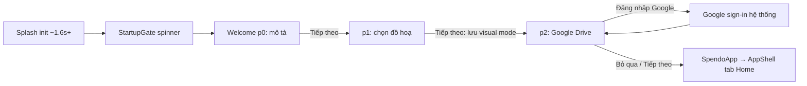
| Bước | Màn | Việc user làm | Element | Kết quả |
|---|---|---|---|---|
| 1 | Splash | chờ | — | auto → Gate |
| 2 | Welcome p0 | đọc 1 câu | "Tiếp theo" (ẩn 1s đầu) | p1 |
| 3 | p1 | (tuỳ) chọn Xịn xò | tile | state |
| 4 | p1 | "Tiếp theo" | | lưu mode, p2 |
| 5 | p2 | (tuỳ) đăng nhập Google | GlassButton | snackbar |
| 6 | p2 | "Tiếp theo" hoặc "Bỏ qua" | | prefs=true → SpendoApp |
- **Tap tối thiểu**: 3 (Tiếp theo ×3) hoặc 2 (Tiếp theo ×2 + Bỏ qua ở p2 — "Bỏ qua" chỉ có ở p2 nên vẫn 3). **Không thể** bỏ qua từ p0.
- **Nhánh lỗi**: Google fail → snackbar, vẫn tiếp tục được. Init lỗi ở Splash → "Thử lại" (không vào được app).
- **Quay lui**: không có (không swipe, không back trong PageView).

## F2. Thêm giao dịch chi (luồng chính)
- **Bắt đầu**: Home. **Kết thúc**: giao dịch trong DB, sheet đóng, list Home cập nhật.
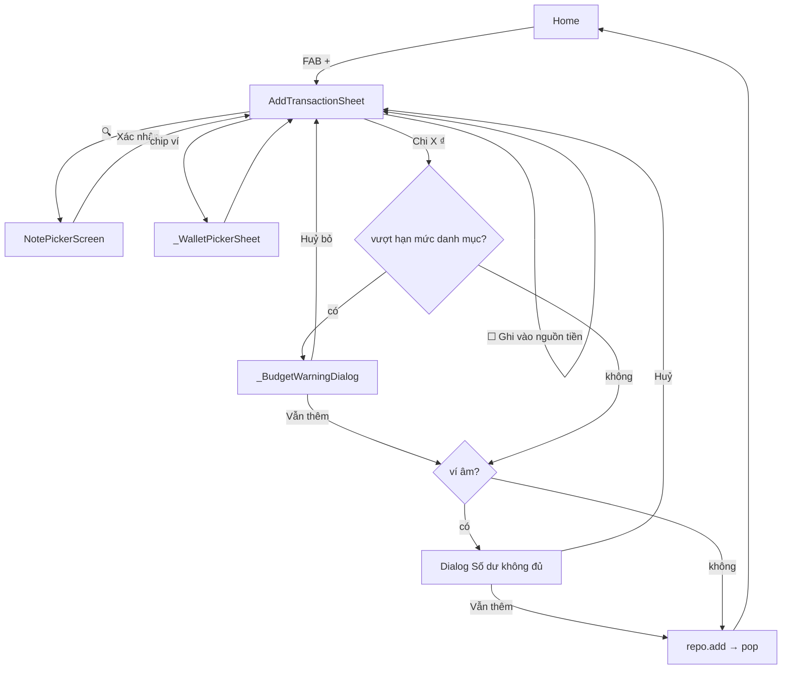
| Bước | Màn | Việc | Element | Kết quả |
|---|---|---|---|---|
| 1 | Home | tap + | FAB | sheet mở, Chi mặc định, category đầu |
| 2 | Sheet | nhập 50000 | numpad `5`,`0`,`0`,`0`,`0` (hoặc `5`,`00`,`00`) | số cập nhật |
| 3 | Sheet | chọn danh mục | chip | (có thể bỏ nếu chấp nhận danh mục đầu) |
| 4 | Sheet | (tuỳ) ghi chú | keyboard → numpad ẩn | auto-category |
| 5 | Sheet | tap "Chi 50.000 ₫" | FilledButton | kiểm tra → pop |
- **Tap tối thiểu**: 1 (FAB) + 3 (5,00,00) + 1 (submit) = **5 tap** (không chọn danh mục, không ghi chú). Với chọn danh mục + ghi chú: 5 + 1 + 1 (tap field) + gõ = ≥7. Với NotePicker: +🔍 +chip +Xác nhận = +3.
- **Nhánh**: Thu (tap "Thu" +1, danh sách category đổi). Ví: +1 checkbox (+2 nếu đổi ví). Cảnh báo: +1 dialog.
- **Điểm thoát/lỗi**: kéo sheet → mất dữ liệu không hỏi; lỗi DB → sheet đứng yên không báo; không có category cho loại → nút vĩnh viễn disabled.
- **Quay lui**: NotePicker X → giữ nguyên; dialog Huỷ → về sheet (dữ liệu giữ).
- **Lối vào thay thế** cùng sheet: Home grid "Thêm" (1 tap, nhưng qua route `/add` → sau khi đóng `go('/')`), AllFeatures "Thêm giao dịch" (3 tap), Transactions tab FAB (2 tap).

## F3. Thêm giao dịch từ notification / widget
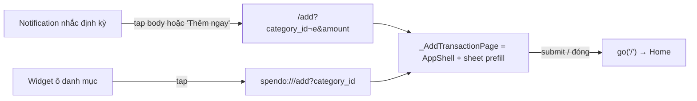
- **Tap**: 1 (notification) + numpad nếu amount trống + 1 submit. Preset reminder có `amountHint` → sheet prefill sẵn số → **2 tap** (notification + submit).
- **Nhánh**: action "Bỏ qua" trên notification → không mở app. App đang mở ở màn khác → `go('/add')` thay stack.
- **Điểm rối**: sau khi đóng sheet luôn về Home tab 1, kể cả user đang ở Transactions.

## F4. Xem / sửa / xoá giao dịch
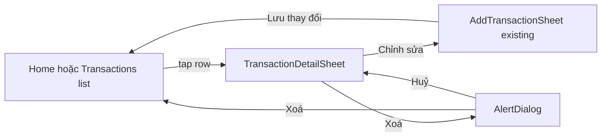
- **Sửa**: 1 (row) + 1 (Chỉnh sửa) + n + 1 (Lưu) = **≥3 tap**. Sửa không cho đổi ngày. Không kiểm tra budget/ví khi sửa.
- **Xoá**: 1 + 1 + 1 = **3 tap**, không undo.
- Không có swipe-to-delete, không multi-select.

## F5. Duyệt theo tháng, lọc, tìm
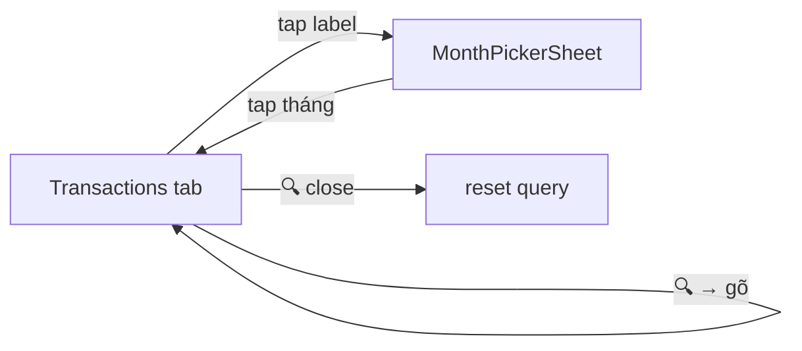
- Tháng trước: **1 tap** (‹). Tháng cụ thể: 1 + (0–2 ‹ › năm) + 1 = **2–4 tap**. Lọc danh mục: 1 tap (scroll ngang nếu >6). Tìm: 1 + gõ.
- **State toàn cục**: tháng share với Home; filter/search **không reset** khi rời màn; bản push `/transactions` không có FAB.
- Không lọc theo loại thu/chi, ví, khoảng ngày; không sắp xếp.

## F6. Đặt hạn mức
### F6a. Hạn mức tháng
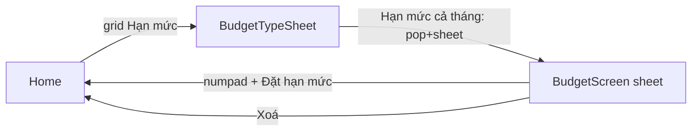
- **Tap**: 1 + 1 + numpad(≥2) + 1 = **≥5 tap**. Từ AllFeatures: 1 (Xem thêm) + 1 (Hạn mức tháng) + … = ≥5.
- Sau khi đặt: **không có nơi nào hiển thị tiến độ** (BudgetCard dead) → user không thấy kết quả. Xoá không xác nhận.
### F6b. Hạn mức danh mục
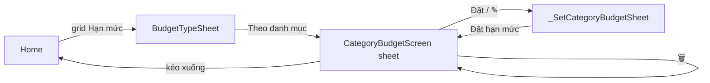
- **Tap**: 1 + 1 + 1 (Đặt) + numpad ≥2 + 1 = **≥6 tap** cho 1 danh mục. Kết quả thấy được ở chip trong AddTransactionSheet (dot/progress) và trong chính list này.
- Xoá tức thì không xác nhận.

## F7. Nguồn tiền (ví)
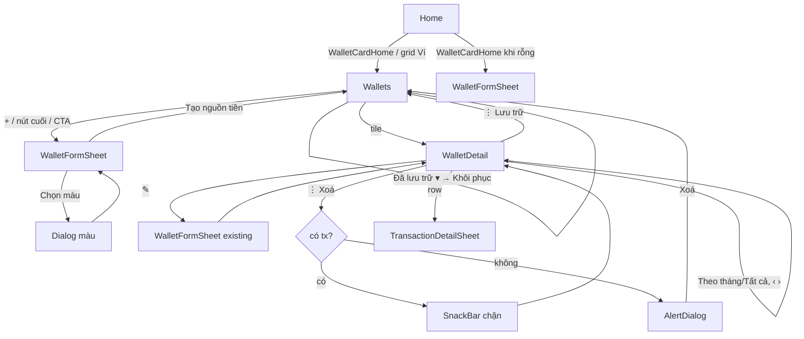
- **Tạo ví**: 1 (grid Ví) + 1 (+) + gõ tên + (0–1 loại) + (0–2 màu) + (numpad số dư 0–n) + 1 = **≥3 tap + gõ**.
- **Xem chi tiết**: 2 tap. **Lưu trữ**: 2 + 1 + 1 = 4 tap, không xác nhận. **Xoá**: 4 + 1 dialog = 5 tap, chỉ khi 0 giao dịch.
- Ghi giao dịch vào ví: chỉ qua checkbox trong AddTransactionSheet (mặc định **tắt**); không có "thêm giao dịch từ màn ví"; không chuyển tiền giữa ví.

## F8. Khoản vay
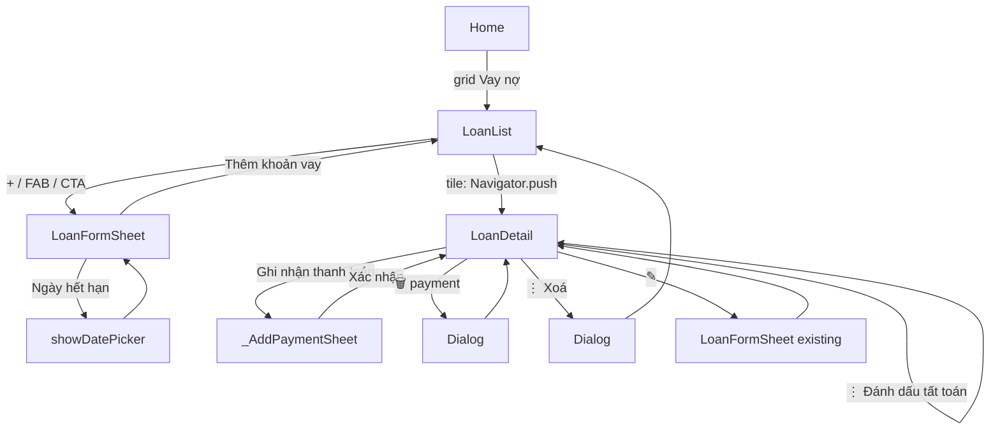
- **Tạo**: 1 + 1 + (0–1 loại) + gõ tên + numpad + 1 = **≥4 tap + gõ**.
- **Ghi thanh toán**: 1 (grid) + 1 (tile) + 1 (Ghi nhận) + numpad ≥2 + 1 = **≥6 tap**; ngày luôn là "bây giờ", ghi chú nhập nhưng không hiển thị.
- **Tất toán**: 3 tap (grid, tile, ⋮) + 1 = 4, không xác nhận; trả đủ không tự tất toán.
- Filter Đang vay/Cho vay chỉ qua AllFeatures (3 tap) — không có trong màn.

## F9. Nhắc nhở định kỳ
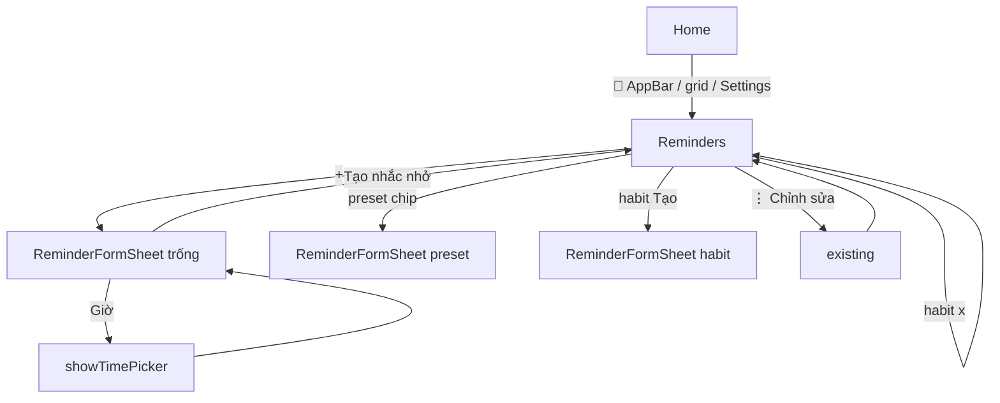
- **Tạo từ preset**: 1 (🔔) + 1 (chip) + 1 (Tạo) = **3 tap** (title/freq/amount/category prefill; giờ 20:00 mặc định).
- **Tạo thủ công**: 1 + 1 (+) + gõ tên + (0–1 category) + (0–2 freq/ngày) + (0–3 giờ) + 1 = ≥4 tap + gõ.
- **Xoá**: 1 + 1 (⋮) + 1 = 3 tap, **không xác nhận**.
- Kết quả chạy nền: notification → F3.

## F10. Xem thống kê
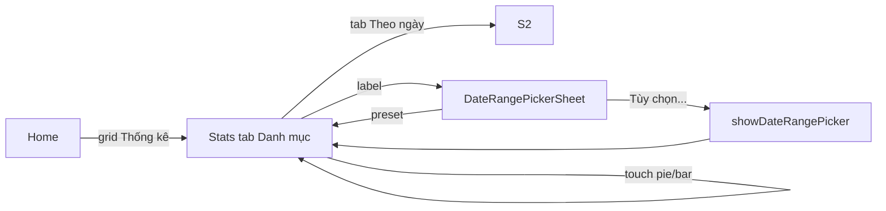
- **Tháng này**: 1 tap. **Tháng trước**: 2 tap (‹) hoặc 3 (label → preset). **Khoảng tuỳ ý**: 1 + 1 + 1 + chọn 2 ngày + OK = **≥6 tap**.
- Không drill-down từ chart → danh sách. Range Stats độc lập với tháng Home.

## F11. Đổi giao diện
- Sáng/Tối/Hệ thống: tab Cài đặt (1) + scroll + tile (1) = **2 tap**.
- Màu chủ đạo: 1 + 1 (Màu chủ đạo) + 1 (chọn) = **3 tap**, áp dụng tức thì, không preview.
- Đồ hoạ: 1 + 1 + 1 = 3 tap.
- Ba tuỳ chọn cùng nhóm nhưng 2 pattern (inline tile vs sheet).

## F12. Sao lưu / khôi phục
### F12a. JSON cục bộ
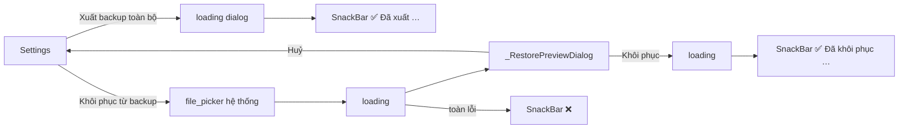
- Xuất: 2 tap (tab + tile) → share/save hệ thống. Khôi phục: 2 + chọn file + 1 (Khôi phục) = **≥4 tap**, 3 lần loading dialog.
### F12b. Google Drive
- Kết nối: 2 tap + Google sign-in. Sao lưu ngay: 2 tap. Tự động: 2 + dropdown (2 tap). Khôi phục: 2 + loading + chọn bản (1) + loading + xác nhận (1) + loading = **≥4 tap, 3 loading**. Ngắt: 2 + dialog 1 = 3.

## F13. Quản lý danh mục
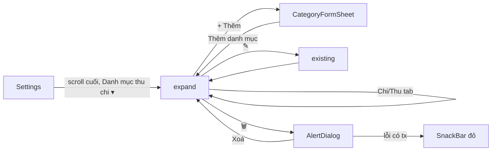
- **Thêm**: 1 (tab) + scroll + 1 (expand) + (0–1 tab Thu) + 1 (Thêm) + gõ + (0–1 màu) + (0–1 icon) + 1 = **≥4 tap + gõ + scroll dài**.
- Danh mục mặc định không xoá được (không nút), chỉ sửa. Không sắp xếp/ẩn/gộp.

## F14. Kết nối SePay
- 1 (tab) + scroll + 1 (Quản lý kết nối SePay → trình duyệt ngoài) — kết nối thật ngoài app. Sau đó: 1 (Thêm tài khoản) + gõ số + chọn bank + chọn ví + 1 (Thêm kết nối) = **≥4 tap + gõ**. Cần có ví trước (không hướng dẫn).
- Giao dịch tự động xuất hiện với badge ⚡ trong list (F4 để xem "Nguồn: SePay").

## F15. Ghim danh mục lên widget
- 1 (tab) + scroll + 1 (slot) + 1 (chọn) = **3 tap** mỗi slot. Bỏ ghim: x 12px. Kết quả chỉ thấy trên launcher Android.

---

## Tổng hợp số tap (đường ngắn nhất từ Home tab)
| Luồng | Tap tối thiểu | Ghi chú |
|---|---|---|
| Thêm chi 50k, danh mục mặc định | 5 | 1 FAB + 3 numpad + 1 submit |
| Thêm chi có danh mục + ghi chú | ≥7 + gõ | |
| Thêm từ notification (có amountHint) | 2 | |
| Xoá giao dịch | 3 | |
| Sửa giao dịch | ≥3 | không đổi ngày |
| Tháng trước (Transactions) | 2 | tab + ‹ |
| Đặt hạn mức tháng | ≥5 | không thấy tiến độ sau đó |
| Đặt hạn mức 1 danh mục | ≥6 | |
| Tạo ví | ≥3 + gõ | |
| Ghi thanh toán khoản vay | ≥6 | |
| Tạo nhắc nhở từ preset | 3 | |
| Xoá nhắc nhở | 3 | không xác nhận |
| Stats tháng trước | 2 | |
| Đổi dark mode | 2 | |
| Khôi phục JSON | ≥4 | 3 loading |
| Thêm danh mục | ≥4 + gõ | scroll cuối Settings |
| Vào Wallets / Loans / Stats / Reminders | 1 | qua Home grid |
| Vào Wallets / Loans / Stats / Reminders từ tab Transactions/Settings | 2 | phải về Home trước (trừ Settings → Reminders 1) |

## Luồng thiếu (không tồn tại trong code)
- Chuyển tiền giữa hai ví.
- Chọn ngày/giờ cho giao dịch.
- Xem giao dịch theo danh mục từ Stats (drill-down).
- Xem tiến độ hạn mức tháng ở bất kỳ màn nào đang dùng.
- Undo cho mọi thao tác xoá.
- Đăng nhập/đồng bộ tài khoản (AuthScreen dead).
- Tìm kiếm trong Settings; anchor từ AllFeatures tới section.
