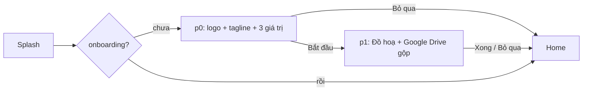
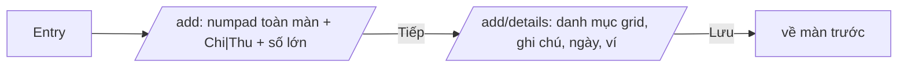
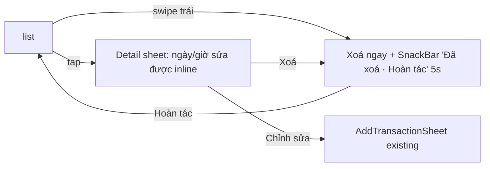
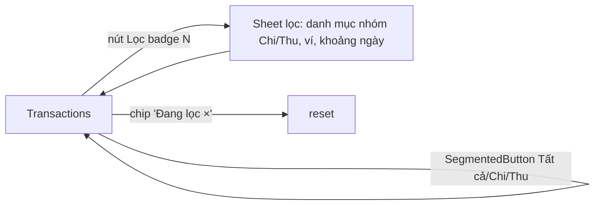
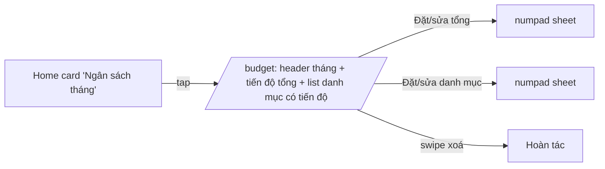
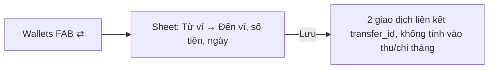

# 08 — Đề xuất thiết kế lại luồng (TO-BE)

> Quy ước: mỗi luồng tham chiếu `05-user-flows.md` (F1…F15) và `06-inconsistencies.md` (A/B/C/D/E/F-xx). Nhãn: **[GIỮ] / [SỬA] / [MỚI] / [BỎ]** kèm lý do 1 câu. "Backend" = ảnh hưởng tới schema PowerSync/Supabase & sync rules: **không** (chỉ UI/provider), **nhẹ** (thêm query/param repo, không đổi schema), **lớn** (đổi schema/sync rule).
> Theo yêu cầu checkpoint: mỗi luồng có **Phương án 1 (giữ cấu trúc, sửa)** và **Phương án 2 (đổi cấu trúc)** để bạn chọn; khuyến nghị ghi rõ.

---

## F1. Onboarding

**Vấn đề (05 F1, 06 B5/E10)**: 3 tap bắt buộc, không skip ở p0–p1, p0 chỉ 1 câu và nửa dưới trống, không indicator, chạy trong MaterialApp#1 nên luôn nền sáng/hồng bất kể theme.

**PA1 [SỬA] — 2 trang, skip mọi nơi, chạy trong theme thật**

- Bước: 3 → **2 tap** (Bắt đầu, Xong) hoặc **1** (Bỏ qua). Thêm dots indicator, cho swipe.
- Được: brand moment giữ (logo `#F06292`, tagline), p1 vẫn giới thiệu Fancy + Drive. Mất: p1 dài hơn (2 khối). Rủi ro: thấp.
- Kỹ thuật: `StartupGate` chuyển thành `redirect` của GoRouter (route `/welcome`) để Welcome render trong `SpendoApp` → theme/dark đúng (giải quyết B5, 02 §1 "hai MaterialApp"). Backend: **không**.

**PA2 [MỚI] — Không onboarding**
- Vào thẳng Home; empty state Home hướng dẫn "Thêm giao dịch đầu tiên"; banner 1 lần ở Settings "Kết nối Google Drive để sao lưu". Bước: **0**.
- Được: nhanh nhất. Mất: không giới thiệu Fancy (user muốn giữ), Drive opt-in ít người thấy. Rủi ro: tỉ lệ bật backup giảm.

**Khuyến nghị: PA1** — user đã chốt giữ logo/tagline và Fancy, PA1 giữ được cả hai với chi phí 1 tap.

> **Quyết định đã chốt sau checkpoint 2 (áp cho toàn file)**: shell **4 tab** (T2.1 MỚI-A) → mọi "tab Giao dịch/Thống kê/Cài đặt" trong sơ đồ là 1 tap; **Undo thay dialog** (F4 PA1, U1) áp cho F6/F7/F8/F9; **Budget gộp** F6 PA1; seed Rose = `#F06292`.

---

## F2. Thêm giao dịch (luồng lõi)

**Vấn đề (05 F2, 06 A2/D2/F1/F8, 04-07 §L)**: 5 tap tối thiểu là chấp nhận được, nhưng: không chọn ngày; "₫ ₫"; numpad 300px biến mất khi gõ ghi chú; NotePicker là màn push riêng (+3 tap); chip danh mục không icon/màu; đóng sheet mất dữ liệu; không báo lỗi lưu; sheet không cuộn (tràn landscape).

**PA1 [SỬA] — Vẫn là bottom sheet, tổ chức lại 3 vùng**
```mermaid
flowchart TD
  FAB[FAB / grid / notification / widget] --> S[Sheet 92% cao, cuộn]
  S --> A[Vùng 1: Huỷ · Chi|Thu · Lưu  +  số tiền lớn]
  S --> B[Vùng 2: grid danh mục 4 cột icon tròn + ô 'Thêm']
  S --> C[Vùng 3: ghi chú + 6 chip gợi ý inline · hàng meta: Ngày/giờ · Ví · Lặp lại]
  S --> D[Numpad cố định đáy; focus ghi chú → numpad thu gọn thành thanh 'Xong']
  D -->|Lưu| V{budget/ví cảnh báo?}
  V -->|có| DLG[Dialog giữ nguyên] --> OK
  V -->|không| OK[lưu → đóng → SnackBar 'Đã thêm · Hoàn tác']
  A -->|Huỷ khi có dữ liệu| CF[Dialog 'Bỏ giao dịch này?']
```
- Bước: thêm nhanh **5 tap** (không đổi); có ghi chú gợi ý **6 tap** (cũ ≥7 + gõ hoặc +3 với NotePicker); đổi ngày **+2** (mới, cũ: không thể).
- Được: một màn, không push; gợi ý ghi chú inline (lấy top-6 history của danh mục đang chọn — dùng lại query `note_picker_screen.dart:82-86`); ngày/giờ chọn được; ₫ sửa; không mất dữ liệu; lỗi hiện SnackBar. Mất: NotePicker (`[BỎ]` — chức năng gộp vào sheet). Rủi ro: sheet cao 92% trên màn thấp → phải cuộn (đã cho cuộn).
- Backend: **không** — `TransactionRepository.add` đã nhận `createdAt?` (`transaction_repository.dart:45`), chỉ cần UI truyền vào.

**PA2 [MỚI] — Trang full-screen `/add` 2 bước**

- Bước: **6 tap** (+1 "Tiếp"). Được: rõ ràng trên màn nhỏ, deep link tự nhiên, không xung đột keyboard/numpad. Mất: chậm hơn cho người thêm 5–10 giao dịch/ngày; mất cảm giác "nhanh" của sheet.
- Backend: nhẹ như PA1.

**Khuyến nghị: PA1** — giữ tốc độ (điểm mạnh hiện tại), sửa toàn bộ lỗi kỹ thuật; PA2 chỉ nếu bạn muốn tối ưu deep link hơn tốc độ.

---

## F3. Thêm từ notification / widget

**Vấn đề (05 F3, 06 E2/A16)**: `/add` `go('/')` sau khi đóng → mất ngữ cảnh; widget chỉ nhận ghim khi đủ 4 slot.

**PA1 [SỬA]** — `/add` không còn là route render `AppShell`; thay bằng `GoRoute` với `pageBuilder` mở sheet trên stack hiện tại (`showModalBottomSheet` từ `navigatorKey.currentContext`) và `pop` thay `go('/')`. Widget Kotlin: dùng từng slot đã ghim, slot trống hiện "+". Bước: không đổi (**2 tap** với amountHint). Backend: **không**.
**PA2 [MỚI]** — Notification action "Ghi ngay ~50.000 ₫" tạo giao dịch trong background isolate (pattern đã có ở `gdrive_background_backup.dart`) không mở app + notification "Đã ghi · Hoàn tác". Bước: **1 tap**. Rủi ro: ghi sai danh mục/số; cần undo chắc chắn. Backend: **nhẹ** (write từ isolate qua PowerSync đã mở).
**Khuyến nghị**: PA1 ngay; PA2 giai đoạn 2 sau khi có undo toàn app (F4).

---

## F4. Xem / sửa / xoá giao dịch

**Vấn đề (05 F4, 06 E9, 04-08 §L)**: xoá 3 tap + dialog, không undo, không swipe; sửa không đổi ngày; grey cứng phá dark.

**PA1 [SỬA] — Swipe + Hoàn tác, bỏ dialog xoá**

- Bước xoá: 3 → **1 tap** (swipe) hoặc 2 (sheet → Xoá). Sửa: không đổi (≥3) nhưng có ngày.
- Được: nhanh, có hoàn tác (an toàn hơn dialog vì dialog thường bị bấm theo quán tính). Mất: cần cơ chế "xoá trễ" hoặc "insert lại với id cũ". Rủi ro: swipe xung đột cuộn ngang? (list không cuộn ngang → không).
- Backend: **nhẹ** — repo cần `insert(Transaction)` giữ `id` (hiện `add` sinh `uuid()` trong SQL `transaction_repository.dart:55-56`), hoặc UI giữ hàng đợi xoá 5s rồi mới gọi `delete` (không cần đổi repo).

**PA2 [MỚI] — Long-press multi-select** (xoá/đổi danh mục/đổi ví hàng loạt). Bước: 1 long-press + n tap + 1. Backend: nhẹ (batch update). Khuyến nghị: PA1 bắt buộc; PA2 giai đoạn 2.

---

## F5. Duyệt theo tháng, lọc, tìm

**Vấn đề (05 F5, 06 A4/E1/E7, 04-06 §L)**: không loading; filter toàn cục không reset; chỉ lọc 1 danh mục (trộn thu/chi); không lọc loại/ví/ngày; bản push mất FAB.

**PA1 [SỬA] — Cùng màn, bộ lọc chuẩn M3**

- Bước tháng trước **2** (không đổi); lọc loại **1 tap** (mới); lọc danh mục 2 tap (cũ 1 nhưng phải scroll ngang).
- Được: lọc đa tiêu chí, filter hiện rõ + reset 1 tap, skeleton khi load. Mất: hàng chip ngang (nhanh khi ít danh mục). Rủi ro: thấp.
- Backend: **không** (lọc client như hiện tại; ví/ngày đã có trong model).
- Kèm: `[BỎ]` route `/transactions` push riêng → Home grid "Giao dịch" chuyển tab (E1).

**PA2 [MỚI] — Thêm chế độ xem Lịch/Tuần** (toggle Danh sách | Lịch: ô ngày có tổng chi). Bước xem ngày cụ thể: 2 tap. Backend: không. Khuyến nghị: PA1; PA2 tuỳ chọn.

---

## F6. Hạn mức

**Vấn đề (05 F6, 06 A6/E5/E9)**: 3 sheet nối nhau; đặt xong không thấy tiến độ ở đâu; xoá tức thì; hạn mức danh mục không có tháng.

**PA1 [SỬA] — Gộp thành 1 trang `/budget`**

- Bước đặt hạn mức tháng: ≥5 → **≥4** (Home card → sheet → numpad → Lưu); danh mục ≥6 → **≥5**. Quan trọng hơn: kết quả **thấy ngay** trên Home (hồi sinh `BudgetCard` đã có sẵn, dead code).
- Được: 1 màn thay 3 sheet; tiến độ hiển thị; xoá có undo. Mất: `BudgetTypeSheet` `[BỎ]`. Rủi ro: thấp.
- Backend: **không**.

**PA2 [MỚI] — Hạn mức danh mục theo tháng + copy tháng trước** (model `category_budgets` thêm cột `month`). Bước: thêm bước chọn "áp dụng cho: tháng này / mọi tháng". Backend: **lớn** (schema + sync rule + migration). Khuyến nghị: PA1; PA2 chỉ khi có nhu cầu thực.

---

## F7. Nguồn tiền

**Vấn đề (05 F7, 06 A1/A3/C13, 04-12/13 §L)**: icon lỗi; 3 lối thêm; không thêm giao dịch từ ví; không chuyển tiền; card tổng khác Home.

**PA1 [SỬA]** — Sửa map icon (`WalletType → LucideIcons` riêng); Wallets: card tổng dùng cùng component với Home, 1 FAB thêm; WalletDetail: FAB "Thêm giao dịch vào ví này" (mở sheet với `trackWallet=true, walletId`); archive có SnackBar hoàn tác thay vì pop im lặng. Bước thêm giao dịch vào ví: cũ 1+ (FAB) +2 (checkbox, chọn ví) = ≥7 → **≥5**. Backend: **không**.
**PA2 [MỚI] — Chuyển tiền giữa ví**

- Backend: **lớn** (cột `transfer_id` + type `transfer`, sync rule, mọi provider tổng phải loại transfer). Khuyến nghị: PA1 ngay; PA2 đưa vào roadmap vì là luồng thiếu rõ nhất (05 "Luồng thiếu") nhưng đắt.

---

## F8. Khoản vay

**Vấn đề (05 F8, 06 A7/A12/A13/E3, 04-15/16/17 §L)**: filter chỉ từ AllFeatures; tile hiện gốc thay vì còn lại; ngày thanh toán cố định; ghi chú không hiển thị; không route; nút submit không sync tên.

**PA1 [SỬA]** — SegmentedButton trong LoanList (Tất cả/Đang vay/Cho vay); tile: còn lại + progress mảnh; header tổng "Đang nợ X · Được nợ Y"; route `/loans/:id`; AddPayment có chọn ngày + hiển thị ghi chú; khi còn 0 → hỏi "Đánh dấu tất toán?"; xoá payment swipe+undo; LoanForm: nút bám `_titleCtrl`, date picker `firstDate` = min(now, dueDate). Bước ghi thanh toán: ≥6 → **≥5** (bỏ 1 tap nhờ nút trên tile "Trả"). Backend: **không** (LoanPayment đã có `paidAt`, `note`).
**PA2 [MỚI]** — Thanh toán tạo giao dịch expense/income tương ứng có ví (liên kết `loan_payment_id`). Backend: **lớn**. Khuyến nghị: PA1.

---

## F9. Nhắc nhở

**Vấn đề (05 F9, 06 A8/E9, 04-18/19 §L)**: xoá không xác nhận/undo; tile thiếu số tiền/lần tới; 2 kiểu gợi ý; số tiền không numpad; `warnBeforeHours` không UI.

**PA1 [SỬA]** — Tile: dòng 2 = "Lần tới: Thứ 5, 20:00 · ~50.000 ₫"; xoá swipe+undo; gợi ý gộp 1 hàng chip (preset + habit cùng style, habit có ✨ và tooltip lý do); form: số tiền dùng numpad sheet như mọi nơi, thêm "Nhắc trước: Tắt/6h/1 ngày" (dùng `warnBeforeHours` sẵn có). Bước tạo từ preset **3** (không đổi). Backend: **không**.
**PA2 [MỚI]** — Nút "Ghi ngay" trên tile → mở AddTransactionSheet prefill (category, note, amount) — tái dùng cơ chế notification. Bước ghi chi định kỳ từ app: **3 tap** (Nhắc nhở → Ghi ngay → Lưu). Backend: không. Khuyến nghị: **cả hai** (PA2 rẻ).

---

## F10. Thống kê

**Vấn đề (05 F10, 06 A9/E7, 04-10 §L)**: chỉ chi; không drill-down; range tách khỏi tháng Home; summary chữ 12px.

**PA1 [SỬA]** — SegmentedButton Chi|Thu trên tab Danh mục; bar chart 2 rod (chi/thu) hoặc toggle; tap legend/ngày → Transactions với filter (danh mục + range) sẵn; khi mode=month dùng chung `selectedMonthProvider` (custom range vẫn riêng); summary 3 số dùng `titleMedium`. Bước xem giao dịch của 1 danh mục: cũ **không thể** → **2 tap**. Backend: **không**.
**PA2 [MỚI]** — Tab "Xu hướng": 6 tháng gần nhất (cột chi/thu theo tháng) + so sánh với tháng trước (Δ%). Backend: **nhẹ** (query range 6 tháng đã có `watchByDateRange`). Khuyến nghị: PA1; PA2 giai đoạn 2.

---

## F11. Giao diện

**PA1 [SỬA]** — Trang `/settings/appearance`: Chế độ (SegmentedButton Hệ thống/Sáng/Tối) · Màu chủ đạo (5 swatch ngang, preview card live) · Đồ hoạ (2 tile). Bước đổi màu: 3 → **2** (Cài đặt → Giao diện → swatch; trang mở sẵn preview). Backend: không.
**PA2 [GIỮ]** — như hiện tại. Khuyến nghị: PA1 (gom 3 tuỳ chọn cùng nhóm, có preview — giải quyết C6-tương-tự cho theme).

---

## F12. Sao lưu / khôi phục

**PA1 [SỬA]** — Trang `/settings/backup`: khối "Trạng thái" (lần cuối, nguồn), Google Drive (kết nối/tần suất/sao lưu ngay/khôi phục), File cục bộ (xuất/nhập), Xuất CSV. Thay 3 loading dialog trần bằng 1 `LinearProgressIndicator` trong sheet "Đang khôi phục…" không thể huỷ + 1 dialog preview dùng chung cho JSON & Drive. Bước không đổi (≥4) nhưng số lớp modal 5 → 2. Backend: không.
**PA2 [MỚI]** — Sao lưu cục bộ tự động hằng ngày (giữ 7 bản) qua Workmanager đã có. Backend: không. Khuyến nghị: PA1; PA2 tuỳ chọn.

---

## F13. Danh mục

**PA1 [SỬA]** — Trang `/settings/categories`: TabBar Chi | Thu, list `ReorderableListView` (dùng `sortOrder` sẵn có), FAB thêm, swipe xoá + undo (chặn nếu có giao dịch với thông báo rõ), form sheet cuộn được + ghi "Danh mục chi/thu". Bước thêm: ≥4 + scroll dài → **3 tap** (Cài đặt → Danh mục → FAB). Backend: **nhẹ** (update sortOrder — cột đã có).
**PA2 [MỚI]** — Ô "＋ Thêm" ở cuối grid danh mục trong AddTransactionSheet → mở CategoryFormSheet → chọn ngay. Bước tạo danh mục khi đang thêm giao dịch: **2 tap** thay vì rời sheet. Backend: không. Khuyến nghị: **cả hai**.

---

## F14. SePay

**PA1 [SỬA]** — Trang `/settings/bank`; form dùng cùng token với các form khác (outline r12 → chuẩn chung, nút chuẩn), validate inline, khi chưa có ví → CTA "Tạo nguồn tiền" ngay trong sheet. Backend: không. **PA2 [GIỮ]**. Khuyến nghị: PA1.

## F15. Widget

**PA1 [SỬA]** — Sửa Kotlin: dùng danh sách ghim thực tế, slot trống = ô "+" mở `/add`; Settings hiển thị preview widget 2×2 mô phỏng. Backend: không (native). **PA2 [MỚI]** — Widget hiện "Chi tháng này: X ₫" (đọc từ prefs do `WidgetSync` ghi thêm). Backend: không. Khuyến nghị: PA1 bắt buộc (bug A16), PA2 tuỳ chọn.

---

## Luồng MỚI hoàn toàn (app rõ ràng thiếu — 05 "Luồng thiếu")

| # | Luồng | Nhãn | Vì sao | Backend |
|---|---|---|---|---|
| N1 | Chọn ngày/giờ giao dịch (trong F2) | [MỚI] | Không thể ghi giao dịch hôm qua — lỗi cơ bản của app ghi chép (04-07 §L) | không (`add(createdAt:)` đã có) |
| N2 | Hoàn tác (Undo) toàn app cho mọi thao tác xoá/lưu trữ/tất toán | [MỚI] | Thay thế 6 dialog xác nhận + 5 chỗ xoá tức thì (06 E9) bằng 1 pattern | nhẹ |
| N3 | Drill-down Stats → Transactions đã lọc | [MỚI] | Biểu đồ hiện là ngõ cụt (04-10 §L) | không |
| N4 | Chuyển tiền giữa ví | [MỚI] | Ví có số dư nhưng không thể chuyển; user phải ghi chi ở ví A + thu ở ví B làm sai tổng tháng (A3) | lớn |
| N5 | Thêm danh mục ngay trong AddTransaction | [MỚI] | Danh mục chôn cuối Settings (06 E4/F13) | không |
| N6 | "Ghi ngay" từ Reminders | [MỚI] | Reminder chỉ có tác dụng qua notification | không |
| N7 | Đăng nhập/đồng bộ tài khoản | [BỎ] `AuthScreen` hiện tại; **[MỞ]** quyết định có làm lại không | Dead code 237 LOC; Supabase anon + PowerSync đang chạy không có UI (04-30) | lớn nếu làm |

## Bảng tổng hợp bước/tap (cũ → mới, theo khuyến nghị)

| Luồng | Cũ | Mới | Ghi chú |
|---|---|---|---|
| Onboarding | 3 | 2 (hoặc 1) | PA1 |
| Thêm chi nhanh | 5 | 5 | giữ; sửa lỗi |
| Thêm chi + ghi chú gợi ý | ≥7 / +3 NotePicker | 6 | inline |
| Đổi ngày giao dịch | không thể | +2 | mới |
| Xoá giao dịch | 3 | 1 (swipe) | undo |
| Lọc theo loại thu/chi | không thể | 1 | |
| Đặt hạn mức tháng & thấy tiến độ | ≥5 / không thấy | ≥4 / thấy trên Home | |
| Thêm giao dịch vào ví cụ thể | ≥7 | ≥5 | FAB trong WalletDetail |
| Ghi thanh toán khoản vay | ≥6 | ≥5 | |
| Xem giao dịch của 1 danh mục từ Stats | không thể | 2 | |
| Đổi màu chủ đạo | 3 | 2 | |
| Thêm danh mục | ≥4 + scroll | 3 | trang riêng |
| Vào Ví/Vay/Nhắc nhở từ tab Giao dịch | 2 | 2 | (Tầng 2 nav 4 tab: Thống kê 1) |
